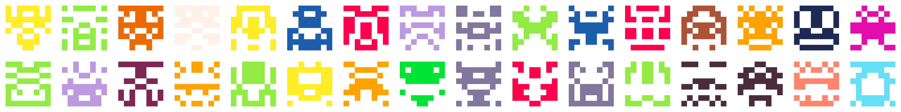

<p align="center">
  
</p>

# ident_gen

### Deterministic, symmetric identicon generator for UUIDs.

- **Deterministic:** same input, same icon, every time.
- **Flexible palettes:** a JSON array of RGB triples, or extract the palette from **any image**.
- **Grids:** render single icons, square `N×N` grids, or rectangular `M×N` ones.
- **Benchmark mode:** visualize color and pixel distribution as a heatmap.

## Install

```sh
npm install
```

## Usage

```sh
node ident_gen.js                # one identicon (8×8 cells)
node ident_gen.js -i 5           # five identicons
node ident_gen.js -s 16          # a higher-resolution icon (16×16 cells)
node ident_gen.js -g 4           # a 4×4 grid
node ident_gen.js -g 3x5         # 3 rows by 5 columns

# Choose where to write
node ident_gen.js -o avatar.png             # one icon to a chosen path
node ident_gen.js -i 3 -o out.png           # out_1.png, out_2.png, out_3.png

# Reproducible output (same seed → same icon)
node ident_gen.js --seed alice -o alice.png
node ident_gen.js -g 4 --seed teamA         # reproducible grid

# Palette from an image
node ident_gen.js -p palettes/dharm32.png   # bundled 32-color palette
node ident_gen.js -p sunset.png -c 8        # any image, capped at 8 colors

# Distribution heatmap over many random UUIDs
node ident_gen.js benchmark -i 10000
```

Output is written to `icons/` unless `--output` is given. Run
`node ident_gen.js -h` for full help.

### Options

| Flag               | Default        | Description                                                      |
| ------------------ | -------------- | ---------------------------------------------------------------- |
| `-s, --size`       | `8`            | Identicon width/height in cells                                  |
| `-g, --gridSize`   | `1`            | Grid dimensions: `N` for `N×N`, or `MxN` for M rows by N columns |
| `-i, --iterations` | `1`            | Number of icons (or benchmark runs)                              |
| `-p, --palette`    | `palette.json` | Palette source: a `.json` RGB array, or an image                 |
| `-c, --colors`     | `32`           | Max colors to take from a palette image                          |
| `-o, --output`     | `icons/…`      | Output path; a 1-based index is inserted when producing many     |
| `--seed`           | _(random)_     | Same seed will yield the same icon(s)          |

### Palettes from images

Point `--palette` at an image and the right thing happens automatically:

- **Swatch / palette images** (at most `--colors` distinct colors) are read
  **exactly** — your colors are used unchanged, in left-to-right / top-to-bottom
  order. No averaging, no merging of near-identical colors.
- **Photos** (more colors than that) are **quantized**: colors are bucketed,
  averaged within each bucket, and the most frequent buckets are kept.

The banner above uses the bundled [`palettes/dharm32.png`](https://lospec.com/palette-list/dharm32-15-bit).

### Reproducible output

Without `--seed`, each icon comes from a fresh random UUID. With a seed, the run
is fully deterministic: the same seed always produces the same icon, grid, or
benchmark. For grids and batches, the icons are derived from `<seed>-<index>`
(row-major, 0-based), so you can regenerate any single cell on its own:

```js
const IdenticonGenerator = require('ident_gen');
const gen = new IdenticonGenerator();

// First cell of `--seed teamA -g 4` as a standalone icon:
gen.saveIdenticon('teamA-0', 8, 'cell0.png');
```

## As a library

```js
const IdenticonGenerator = require('ident_gen');

// Default palette (palette.json)
const gen = new IdenticonGenerator();
gen.saveIdenticon('your-uuid-here', 8, 'icon.png');

// Colors extracted from an image
const themed = new IdenticonGenerator({ palettePath: 'sunset.png', maxColors: 8 });
themed.saveIdenticon('your-uuid-here', 8, 'icon.png');
```

## License

[MIT](LICENSE)
